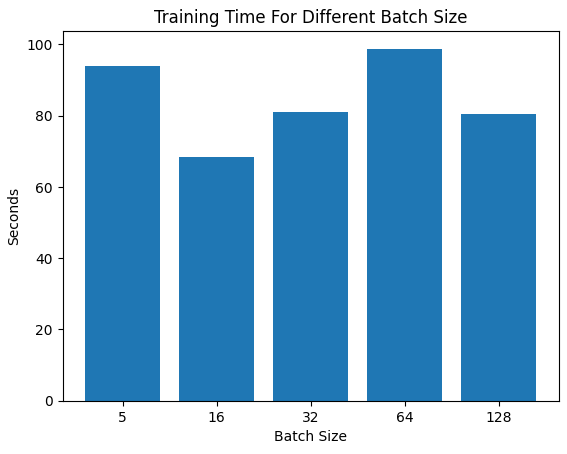
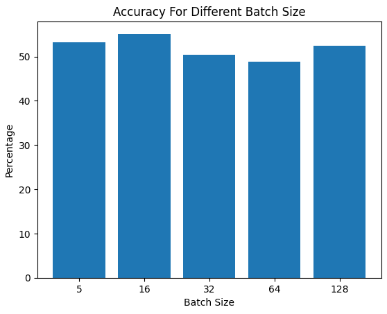
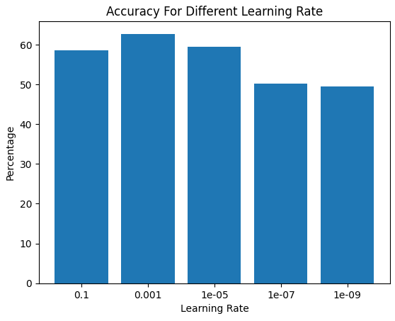
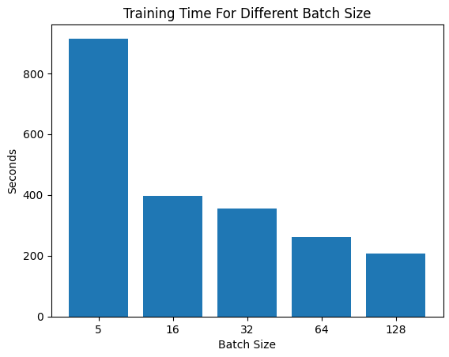
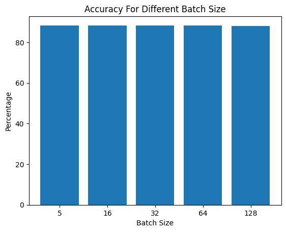

# Sentiment Analysis with PyTorch: Logistic Regression and LSTM

## Overview

This is a personal side project where I explored sentiment analysis using PyTorch, focusing on implementing minibatching for both logistic regression and LSTM models. The aim was to classify movie reviews from the IMDB dataset as positive or negative, experimenting with how minibatching impacts training efficiency and model performance. I built this project to deepen my understanding of neural networks, data preprocessing, and hyperparameter tuning, all while working with a real-world dataset.

## Features

- **Sentiment Analysis**: Determines if a movie review expresses positive or negative sentiment.
- **Minibatching**: Implements batch processing with padding for variable-length inputs.
- **Two Models**:
  - **Logistic Regression**: A simple model with an embedding layer and linear output.
  - **LSTM**: A recurrent model with LSTM feature extraction, average pooling, and a feedforward layer.
- **IMDB Dataset**: Uses the standard movie review dataset for training and evaluation.
- **Hyperparameter Tuning**: Experiments with batch size and learning rate to optimize performance.

## How It Works

### Data Preprocessing
- **Tokenization**: Converted reviews into sequences of word indices, setting words appearing fewer than 3 times as "unknown" tokens.
- **Padding**: Added padding tokens (index 0) to ensure uniform sequence lengths in each minibatch. For example, a sequence `[12, 1, 5, 6]` with a max length of 10 becomes `[12, 1, 5, 6, 0, 0, 0, 0, 0, 0]`.
- **Splitting**: Shuffled the dataset and allocated 7,500 reviews for a development (dev) set.
- **Tools**: Utilized `torch.nn.utils.rnn` functions like `pad_sequence()` for efficient minibatching.

### Logistic Regression Model
- **Architecture**:
  - Embedding layer to convert word indices into vectors.
  - Linear output layer to predict sentiment (positive/negative).
- **Minibatching**: Adapted a single-instance version to process batches, verifying loss consistency with the original.

### LSTM Model
- **Architecture**:
  - Embedding layer for word vectors.
  - LSTM layer to process sequences, with packing/unpacking to handle padded inputs.
  - Average pooling of hidden states, followed by a feedforward layer for classification.
- **Minibatching**: Used `pack_padded_sequence()` and `pad_packed_sequence()` to ensure the LSTM only processes non-padded tokens.

### Evaluation
- Compared minibatched vs. single-instance outputs to ensure correctness (scores were close but not identical due to batching effects on gradients).
- Tuned batch size and learning rate, recording training time and dev set accuracy.

## Technical Details
- **Language**: Python
- **Framework**: PyTorch
- **Dataset**: IMDB movie reviews
- **Dependencies**: `torch`, `numpy`, `matplotlib` (for plotting)

- Adjust hyperparameters in the script as needed (batch size, learning rate, etc.).

## Usage
- Run theyour script to train and evaluate the models.
- Use the dev set to tune batch size and learning rate, then test the best model on the test set.
- Check the "Showcase" section for performance plots.

## Showcase
Here are some visualizations from my experiments:

  
*Training time comparison for different batch sizes in the logistic regression model.*

  
*Dev set accuracy for different batch sizes in the logistic regression model.*

  
*Dev set accuracy for different learning rates with a fixed batch size (Logistic).*

  
*Training time comparison for different batch sizes in the LSTM model.*

  
*Dev set accuracy for different batch sizes in the LSTM model.*

## Observations
- **Training Time**: Larger batch sizes generally reduced training time (e.g., batch size 16 was faster than 1), though results varied due to limited epochs.
- **Accuracy**: Both models achieved around 86% accuracy on the dev set, with minor differences across batch sizes. The LSTM’s robustness surprised me—batch size had less impact than expected.
- **Errors**: Misclassifications often occurred with noisy or ambiguous reviews (e.g., mixed sentiments or convoluted phrasing), which are tough even for humans to judge.

## Results
- **Best Logistic Model**: Achieved competitive accuracy on dev and test sets (see plots in Showcase).
- **Best LSTM Model**: Slightly better generalization due to sequential processing, with results visualized in the Showcase section.

## What I Learned
- Mastered minibatching and padding in PyTorch for efficient training.
- Gained hands-on experience with LSTM packing/unpacking for variable-length sequences.
- Explored the trade-offs between training speed and accuracy through hyperparameter tuning.

## Future Ideas
- Add attention mechanisms to the LSTM for better context understanding.
- Experiment with larger epochs to stabilize training time patterns.
- Try other datasets or preprocessing techniques (e.g., subword tokenization).
